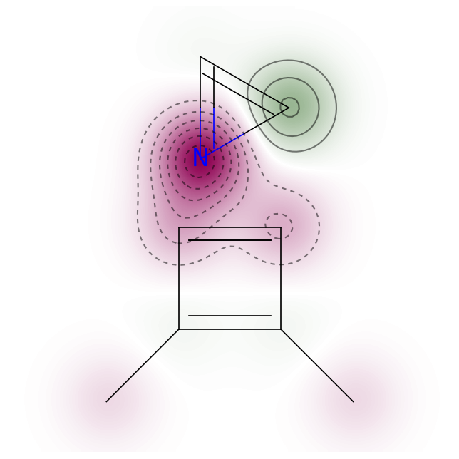

# Quantum GAN with Hybrid Generator
PennyLane and Pytorch implementation of QGAN-HG: Quantum generative models for small molecule drug discovery, based on MolGAN (https://arxiv.org/abs/1805.11973)  
This library refers to the following source code.
* [jundeli/quantum-gan](https://github.com/jundeli/quantum-gan)
* [yongqyu/MolGAN-pytorch](https://github.com/yongqyu/MolGAN-pytorch)
* [nicola-decao/MolGAN](https://github.com/nicola-decao/MolGAN)
* [yunjey/StarGAN](https://github.com/yunjey/StarGAN)


For details see [Quantum Generative Models for Small Molecule Drug Discovery](https://arxiv.org/abs/2101.03438) by Junde Li, Rasit Topaloglu, and Swaroop Ghosh.


## Dependencies

* **python>=3.5**
* **pytorch>=0.4.1**: https://pytorch.org
* **rdkit**: https://www.rdkit.org
* **pennylane**
* **tensorflow==1.15**
* **frechetdist**

## Structure
* [data](https://github.com/SenpaiKirigaia/qh-gan/blob/main/data): should contain your datasets. If you run `download_dataset.sh` the script will download the dataset used for the paper (then you should run `data/sparse_molecular_dataset.py` to conver the dataset in a graph format used by MolGAN models).
* [models](https://github.com/SenpaiKirigaia/qh-gan/blob/main/models.py): Class for Models.

## Training
```
python main.py --quantum True --circuit main --layer 2 --qubits 10 --complexity hr
```
If you want to run classical MolGAN, please set quantum argument to False. But you can still train reduced models by setting complexity to 'hr'-highly reduced (around 2% of original generator papameters), 'mr'-moderately reduced (around 15%), or 'nr'-no reduce. Layer and qubits can adjust expressive power of variational quantum circuit.


## Demo
You can see generated small molecules with pretrined models which are included in qgan-.../models. Quantum circuit parameters are shown in quantum_weights_{model}.csv.

```
comparison-demo.ipynb
```
Below are some generated molecules:

<div style="color:#0000FF" align="center">
 

</div>

